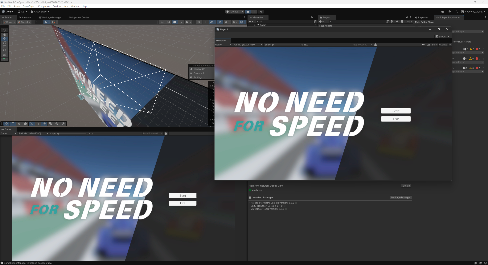
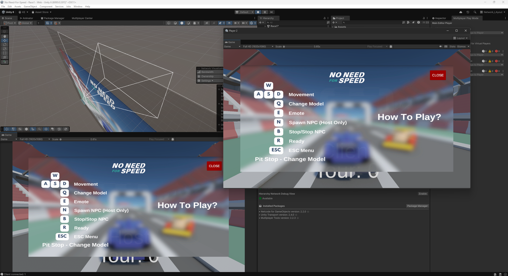
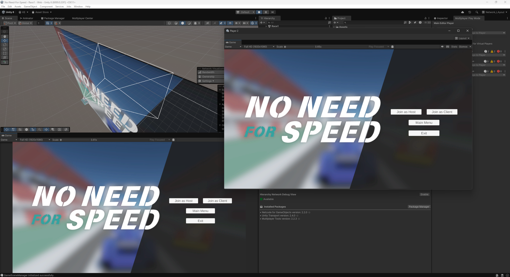
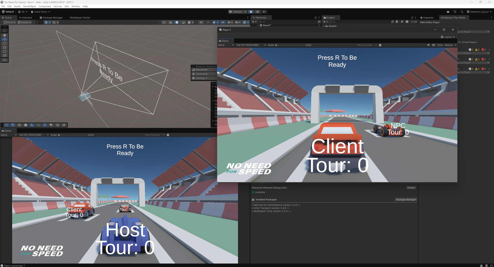
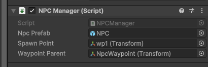
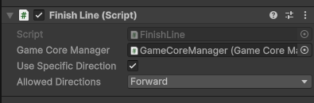
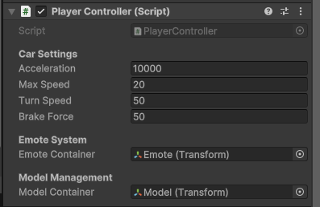
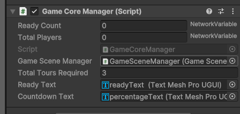
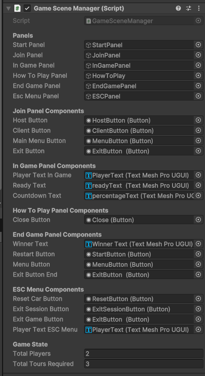
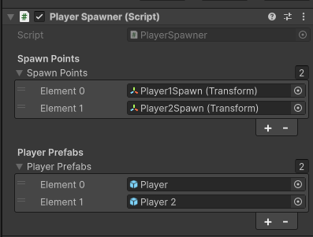

# No Need For Speed
FG Game Network Course Assigment
 
- Futuregames Academy
- (13 January 2025)
- Teacher referance: <a href="">Toby van Buynder</a>

### Title: No Need For Speed

   
  <a href="">Try Game On Browser</a>

"No Need For Speed" is a networked multiplayer racing game developed using Unity's Netcode for GameObjects (NGO). The focus is on fun, accessibility, and balanced multiplayer gameplay rather than realistic physics or high-speed precision. The game features dynamic environments, customizable vehicles, and a finish-line mechanic that tracks progress across multiple tours.

---

## Key Features

- **Multiplayer Racing**: Synchronization across clients ensures smooth gameplay.
- **Dynamic NPCs**: Autonomous movement controlled server-side.
- **Customization**: Vehicle models and emotes for personalization.
- **User-Friendly Interface**: Start panel, in-game HUD, and ESC menu.
- **Seamless Transitions**: Smooth state changes between start, join, and finish.

---

## Controls

 

---

## Screenshots

Screenshots           |  Screenshots 
:-------------------------:|:-------------------------:
  |  
  |  

---

## Implementation Details

### Player Management
- Players spawn at designated points using the `PlayerSpawner` script.
- Positions and movements synchronize via `NetworkObject` and `ClientNetworkTransform`.

### Script Breakdown

#### AutoAddPlayerToVcamTargets.cs

- Dynamically assigns players as tracking targets for the virtual camera.
- Detects players with specific tags (`Player`, `Player2`).
- Uses delayed execution to ensure proper initialization.

#### NPCManager.cs
 

- Manages NPC spawning and movement toggling.
- Ensures server-side control of NPC instances using `NetworkObject`.
- Supports resetting or toggling NPC movement states.

#### FinishLine.cs
 

- Tracks progress when players or NPCs cross the finish line.
- Validates crossing directions and communicates with `GameCoreManager`.

#### PlayerController.cs
 

- Handles player movement, braking, and turning using Rigidbody physics.
- Manages emotes and model changes synchronized via server and client RPCs.

#### GameCoreManager.cs
 

- Centralizes game logic, including player readiness, countdowns, and progress tracking.
- Uses `NetworkVariable` for shared states and `ClientRpc` for UI updates.
- Declares winners and manages end-game states.

#### ClientNetworkTransform.cs

- Implements client-authoritative synchronization for smoother player control.

#### Pit.cs

- Detects when players enter a pit area and triggers vehicle model changes.
- Uses `PlayerController` for updates.

#### GameSceneManager.cs
 

- Manages game scenes, UI panels, and state transitions.
- Handles player connections, disconnections, and game state transitions.
- Integrates Unity’s `SceneManager` for scene control.

#### NPCMovement.cs

- Governs NPC movement along predefined waypoints.
- Synchronizes movement states using server and client RPCs.
- Smoothly rotates NPCs toward their next target.

#### PlayerSpawner.cs
 

- Spawns players at designated points based on connected client IDs.
- Supports multiple player prefabs for variety.
- Ensures synchronization using `NetworkObject`.

---

## Challenges Faced and Solutions Implemented

### Smooth Player Synchronization
- Used `ClientNetworkTransform` for client-authoritative movement to reduce latency.

### Dynamic NPC Behavior
- Managed NPC states server-side, synchronized with `ServerRpc` and `ClientRpc`.

### Handling Disconnections
- Added callbacks in `GameSceneManager` to detect and manage disconnections.

### UI Synchronization
- Utilized `NetworkVariable` and `ClientRpc` for real-time updates.

---

## Reflection on the Learning Experience

### Synchronization, Server Authority, and Optimizations
- **Synchronization**: Ensured consistent states across clients using `NetworkVariable` and `ClientRpc`.
- **Server Authority**: Executed critical game logic server-side to prevent cheating and ensure fairness.
- **Optimizations**:
  - Reduced frequency of network updates for NPCs.
  - Employed object pooling for frequently instantiated objects.
  - Minimized unnecessary RPC calls by consolidating updates.

This project enhanced understanding of multiplayer game development, emphasizing the importance of efficient synchronization, server authority, and strategic optimizations to balance performance and gameplay features.